# 🐾 Wild Bites Case Study
A cozy cooking sim where animal customers serve up mysteries with their meals

## 📌 Overview
- **Genre:** Narrative Cooking Simulation
- **Platform:** PC (itch.io)
- **Development Time:** 5 months (Academic Project → Expanded Post-Graduation)
- **Inspirations:** Good Pizza, Great Pizza’s charm × Cooking Mama’s mini-games × Coffee Talk’s storytelling

### 👩‍💻 My Roles
- **Product Manager/Team Leader:** Pitched concept, formed team, prioritized features
- **Co-Scrum Master:** Ran Agile sprints using Trello
- **UX/UI Designer:** Wireframed (Figma), prototyped (HTML/CSS/JS), and implemented Unity UI
- **Artist:** Created all character sprites and restaurant assets (Procreate)
- **Programmer:** Developed core mechanics in C# (dialogue, cooking mini-games)

## 🎮 Development Journey
### **1. From Sketch to Prototype**
Academic Phase (Advanced Game Dev Course):
- Pitch Success: My Wild Bites concept (backed by Procreate mockups) was selected from 6 pitches to become a team project. See Pitch Presentation [Here](https://docs.google.com/presentation/d/11Vi-VCzIaCUh3sMcYSTs1IfIRPhEsT-tNvg_P73OJ54/edit?usp=sharing).
- Tech Demo: Built a dress-up feature prototype with HTML/CSS/JavaScript to validate the customization system. See protoype  https://jumanacs.github.io/Dress-Up/.
- Showcase Ready: Led the team to deliver a vertical slice for the end-of-semester showcase.
**Key Challenge:** Balancing academic deadlines with ambitious scope.
**Solution:** Focused on one "perfect" customer journey (Louis the crawfish) to demonstrate full gameplay loop.

### **2. Post-Graduation Polish**
- Expanded the prototype into a full itch.io release
- Fixed UI to fit all screen sizes
🎥 Final Game Walkthrough: https://youtu.be/lyA2G2dNQmQ
🎮 Play Now: https://jumanacs.itch.io/wild-bites

## ✨ Key Features & Design Decisions
### **🍳 Cooking Mechanics**
- Species-Based Orders:
  - Design Insight: Players must observe visual/verbal clues (e.g., raccoon = urban → burger, monkey = tropical → banana).
  - Tech: C# dictionaries map animal traits to meal combos.
- Mini-Games:
  - Chopping (clicking space), mixing (drag-and-drop), plating (dragging into to-go box).
  - Goal: Make cooking feel tactile without frustrating players.

### 🕵️ Narrative Design
- Branching Dialogues:
  - Wrote 50+ dialogue branches balancing hints, humor, and character development.
  - Example: Detective Remy’s conversations reveal case clues only if players earn his trust.

### 🎨 Cozy Aesthetic
- Art Style: Warm colors, soft outlines, and expressive animations to evoke comfort.
- UI/UX:
  - Utalized Unity UI to add buttons, make images dynamic across screens using Canvas, and text boxes for the dialogue.  
  - Added chef customization to boost player attachment.
 
## 📊 Results & Takeaways
- Showcase Feedback:
  - Players loved the Crawfish from New Orleans and wanted more animals.
- Lessons Learned:
  - Scope management is critical (cut features we wanted to polish cooking).
  - Playtest early for UX pain points (original UI was not dynamic and I had to go back and fix all the UI).
  - 
### 🔜 Future Plans:
- Add 5+ new animals 
- Expand restaurant customization
- Solve the Golden Truffle mystery!

## Sprints on Trello

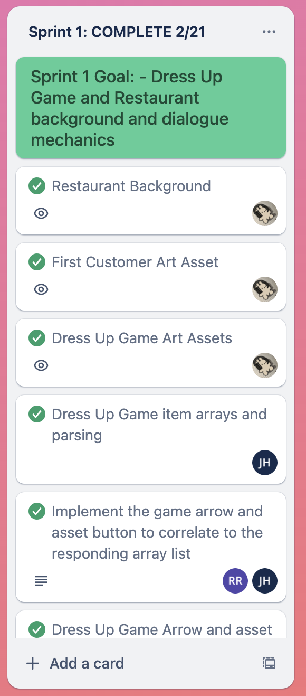
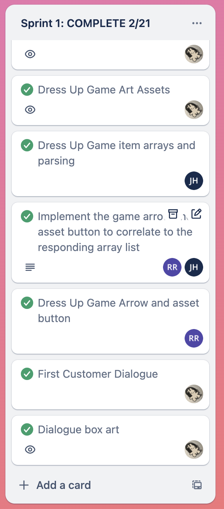
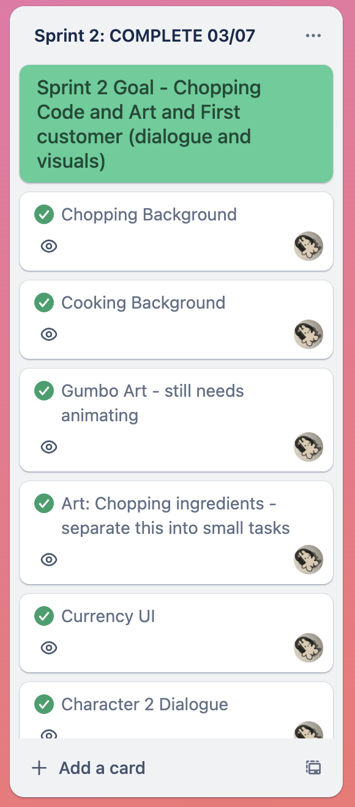
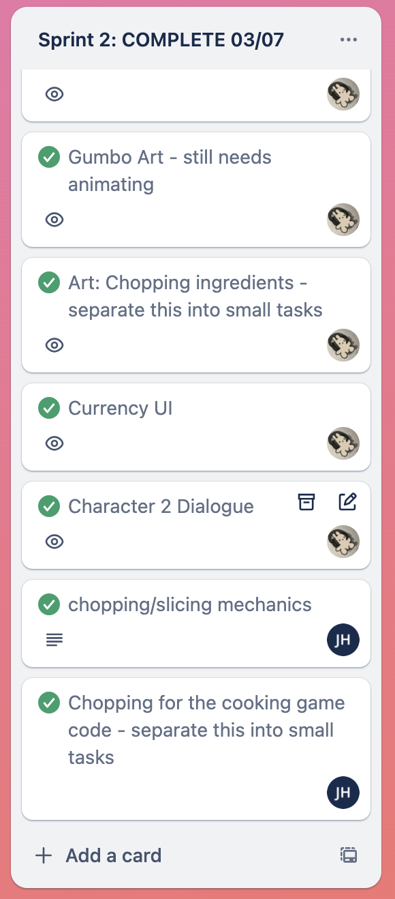

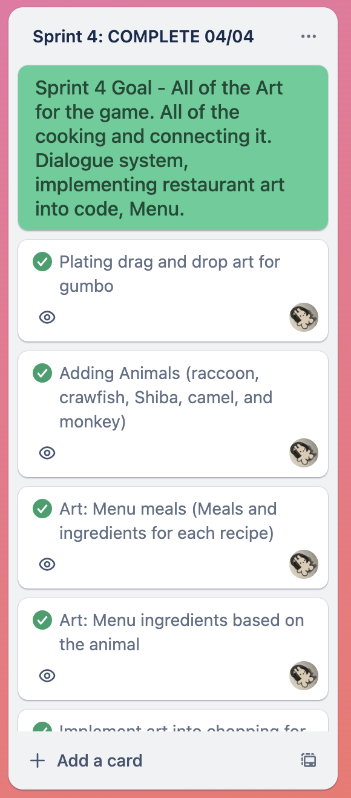
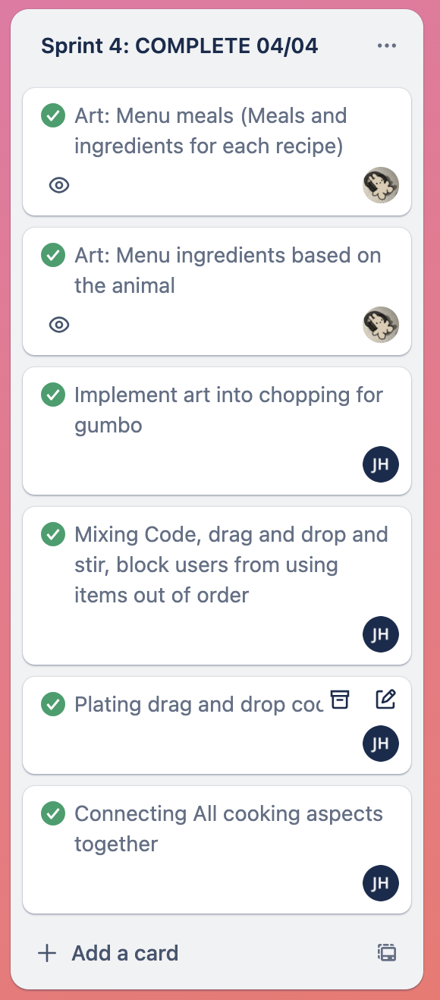
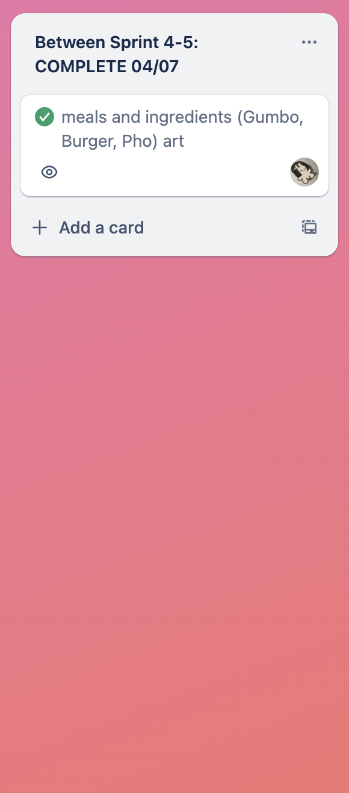

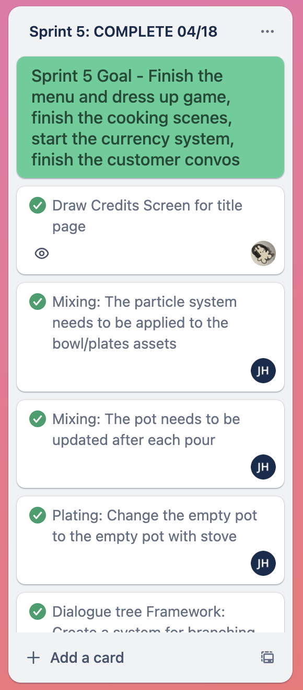
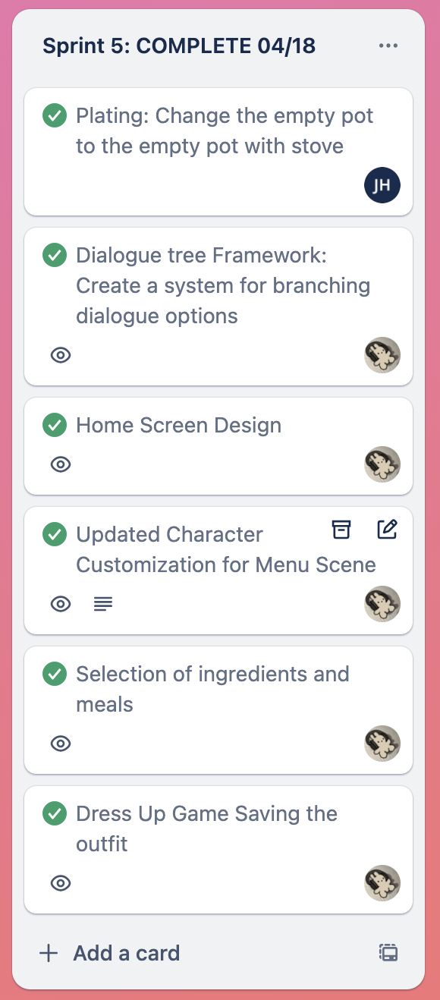
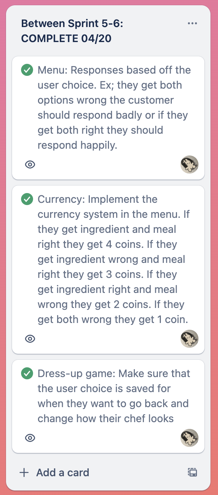
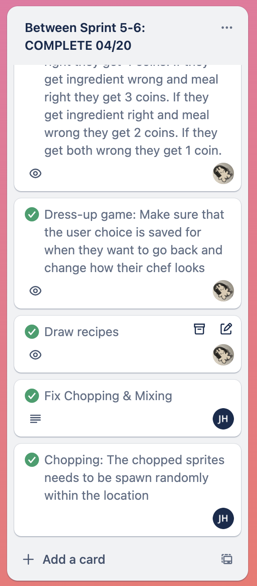

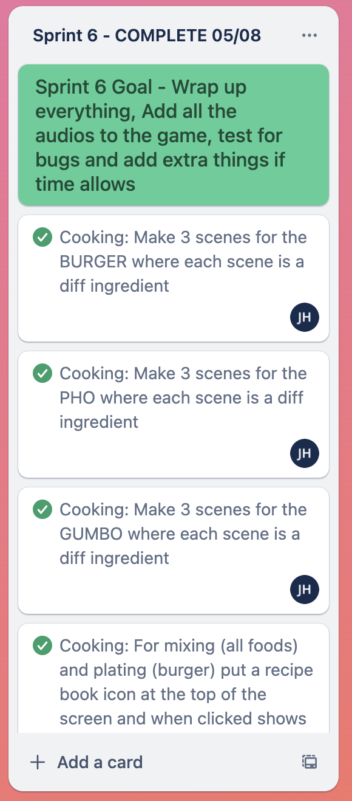
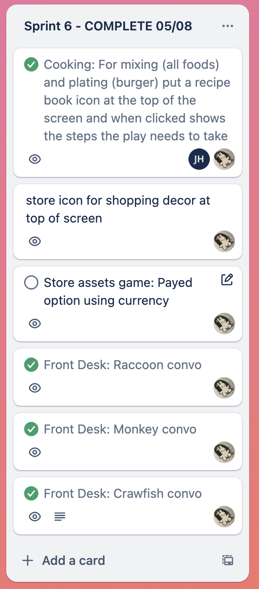
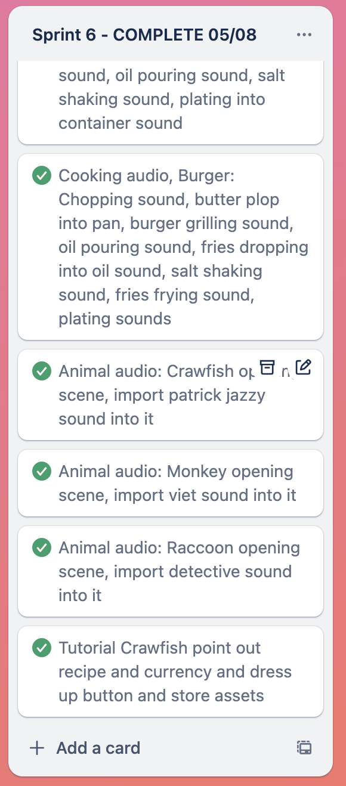
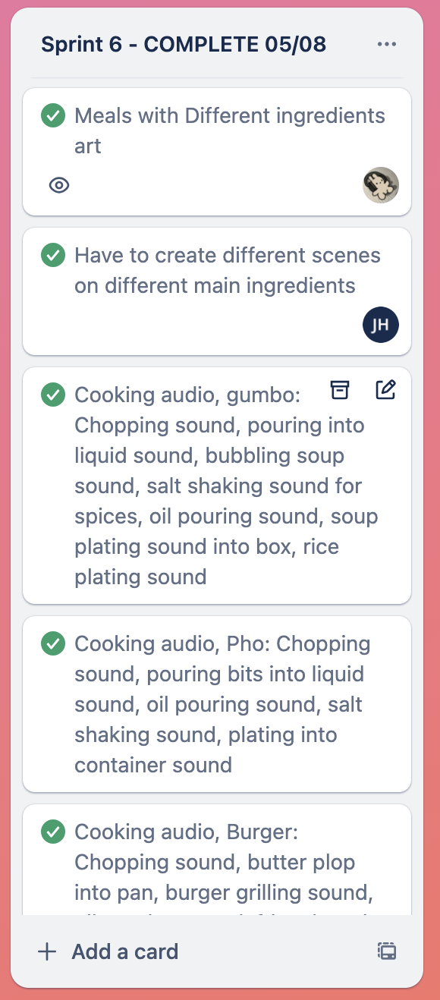

# 🍜 Screenshots from the Wild Bites 

